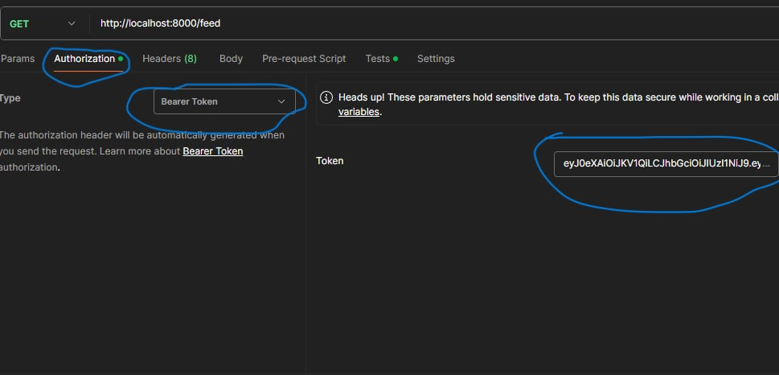

Сервис для регистрации и авторизации.

### Установка и запуск

```bash
cp .env.example .env
```

```bash
docker-compose up -d
```
В самом файле .env в параметре 'HOST=docker_container_name' вместо 'docker_container_name' нужно указать название контейнера с mysql

[Коллекция postman c API эндпоинтами.](./auth_api.postman_collection.json) Для авторизации используется Bearer token.


